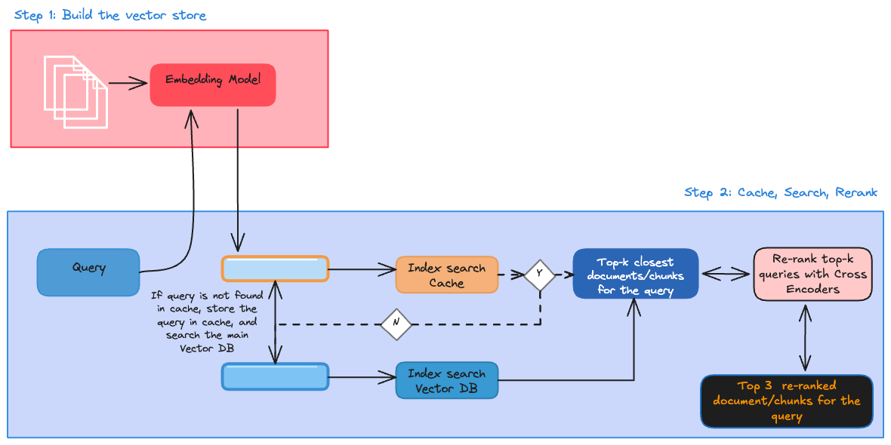

# HelpMateAI: RAG Generative Search for Insurance Policy Documents

HelpMateAI is a Retrieval-Augmented Generation (RAG) system that answers questions from a long life insurance policy document. It combines PDF parsing, page-level chunking, OpenAI embeddings, ChromaDB vector search, semantic caching, CrossEncoder reranking, and GPT-based answer generation with source citations.

The project is based on the Mr. HelpMate AI assignment brief in `index.ipynb` and the implementation/report in `HelpMateAI.ipynb` and `Helpmate AI V1.0 Ujwal Abhishek.pdf`.

## Objective

The goal is to build a robust generative search system that can accurately answer user questions from a group life insurance policy. The system implements the three core RAG layers:

1. **Embedding layer**: Extract, clean, and chunk PDF text before creating embeddings.
2. **Search layer**: Retrieve relevant chunks from ChromaDB, use a semantic cache for repeated queries, and rerank candidates with a CrossEncoder.
3. **Generation layer**: Pass the top retrieved chunks to an LLM with a carefully designed prompt to generate direct answers with policy name and page citations.

## Architecture


The pipeline follows this flow:

1. Load the insurance policy PDF from `data/raw/`.
2. Extract text and tables using `pdfplumber`.
3. Store each meaningful PDF page as one chunk with metadata.
4. Generate embeddings with OpenAI `text-embedding-ada-002`.
5. Store vectors in a persistent ChromaDB collection named `RAG_on_Insurance`.
6. Search the semantic cache collection named `Insurance_Cache`.
7. If no close cached query is found, search the main vector collection.
8. Rerank retrieved chunks with `cross-encoder/ms-marco-MiniLM-L-6-v2`.
9. Send the top 3 reranked chunks to GPT-3.5 for final answer generation.
10. Return a concise answer with citations.

## Repository Structure

```text
.
├── HelpMateAI.ipynb                         # Main implementation notebook
├── index.ipynb                              # Assignment brief and evaluation rubric
├── Helpmate AI V1.0 Ujwal Abhishek.pdf      # Project report
├── data/raw/
│   └── Principal-Sample-Life-Insurance-Policy.pdf
├── chroma/                                  # Persisted ChromaDB vector store
├── system architecture.png                  # RAG pipeline architecture
├── cache rachitecture.png                   # Cache architecture diagram
├── CrossEncoder.png                         # CrossEncoder reference image
├── example.env                              # Placeholder for environment variables
├── LICENSE
└── README.md
```

## Dataset

The project uses a single policy document:

`data/raw/Principal-Sample-Life-Insurance-Policy.pdf`

The document is a Principal sample group member life insurance policy. It contains policy definitions, eligibility rules, premiums, termination conditions, benefits, claim procedures, and related insurance provisions.

## Implementation Details

### 1. PDF Processing

The notebook uses `pdfplumber` to read the policy PDF because it can extract both regular text and tables. A helper function separates table content from non-table words using bounding boxes, then rebuilds the page content in reading order.

Each extracted row contains:

- `Page No.`
- `Page_Text`
- `Document Name`
- `Text_Length`
- `Metadata`

Pages with fewer than 10 words are removed to avoid indexing blank or low-value pages.

### 2. Chunking Strategy

The project uses page-level chunking instead of smaller text windows.

This choice was made because most pages contain only a few hundred words, with the largest page around 460 words. Insurance policy pages usually group related clauses together, so a full page often preserves better legal and policy context than smaller chunks.

### 3. Embeddings and Vector Store

The notebook embeds each page using OpenAI `text-embedding-ada-002` and stores the vectors in ChromaDB.

Main collection:

```text
RAG_on_Insurance
```

Stored data includes:

- Page text as the document
- Integer string IDs
- Metadata containing policy name and page number

### 4. Semantic Cache

A second ChromaDB collection stores previous queries and their retrieved results.

Cache collection:

```text
Insurance_Cache
```

The notebook uses a cache distance threshold of `0.2`. If a new query is semantically close enough to a cached query, results are returned from cache. Otherwise, the system searches the main policy collection and then stores the query-result mapping in cache.


### 5. Reranking

The first semantic search retrieves candidate chunks from ChromaDB. These candidates are then reranked using:

```text
cross-encoder/ms-marco-MiniLM-L-6-v2
```

The CrossEncoder receives query-document pairs and produces relevance scores. The top 3 reranked chunks are used as the final context for generation.



### 6. Answer Generation

The generation layer uses GPT-3.5 with a domain-specific prompt. The prompt instructs the model to:

- Answer only from retrieved policy context.
- Include accurate numbers when available.
- Reformat relevant table content when needed.
- Cite policy name and page number.
- Respond that the query is irrelevant if the retrieved content does not support an answer.
- Avoid exposing internal system details to the user.

## Example Query

The notebook demonstrates the pipeline with:

```text
What is the scheduled Member Life Insurance benefit for all members?
```

The system retrieves relevant policy pages, reranks them, and generates a final answer with a citation to the source page.

## Setup

Create and activate a Python environment:

```bash
python3 -m venv .venv
source .venv/bin/activate
```

Install dependencies:

```bash
pip install -U pdfplumber tiktoken openai chromadb sentence-transformers pandas jupyter
```

Add your OpenAI API key. The current notebook reads the key from a local path:

```python
filepath = "../6.ShopAssist_ Data + Demo/"
with open(filepath + "openai_key.txt", "r") as f:
    openai.api_key = " ".join(f.readlines())
```

For a cleaner local setup, replace that cell with:

```python
import os

openai.api_key = os.environ["OPENAI_API_KEY"]
```

Then export the key before running the notebook:

```bash
export OPENAI_API_KEY="your_api_key_here"
```

## How to Run

Start Jupyter:

```bash
jupyter notebook
```

Open and run:

```text
HelpMateAI.ipynb
```

Run the notebook cells in order:

1. Install and import dependencies.
2. Extract text from the PDF.
3. Build the processed dataframe and metadata.
4. Create the ChromaDB collections.
5. Add policy page embeddings.
6. Enter a user query.
7. Run semantic search with cache.
8. Rerank results with the CrossEncoder.
9. Generate the final cited answer.

## Evaluation Criteria

The assignment rubric in `index.ipynb` evaluates the system across:

| Area | Weight | Focus |
| --- | ---: | --- |
| Overall system design | 10% | Architecture, workflow, and implementation quality |
| Embedding layer | 25% | PDF processing, chunking strategy, embedding model usage |
| Search layer | 30% | Retrieval quality, cache implementation, reranking |
| Generative layer | 10% | Prompt quality and final answers |
| Query search | 10% | Testing with at least three user-designed queries |
| Documentation | 15% | Goals, data sources, design choices, and challenges |

## Challenges and Learnings

### Latency vs Accuracy

The system balances response speed with answer quality. ChromaDB retrieval and cache lookup are fast, but CrossEncoder reranking and LLM generation add latency. The cache helps reduce repeated work for similar user queries.

### Chunk Tuning

Page-level chunking worked well for this document because each page is short enough for embedding and generation context, while still preserving policy context. Smaller chunks could lose important surrounding clauses; larger chunks could reduce retrieval precision.

### Hallucination Control

The system reduces hallucination by reranking retrieved chunks, passing only the top relevant pages to the model, and instructing the LLM to answer from the provided context with citations.

## Notes

- The persisted `chroma/` directory is included in the repository, but you can rebuild it by rerunning the embedding cells.
- The notebook currently uses OpenAI's older `text-embedding-ada-002` embedding model and GPT-3.5 generation model, matching the implementation.
- `index.ipynb` is primarily the project brief and rubric; `HelpMateAI.ipynb` contains the main RAG implementation.

## License

This project is licensed under the GNU General Public License v3.0. See `LICENSE` for details.
